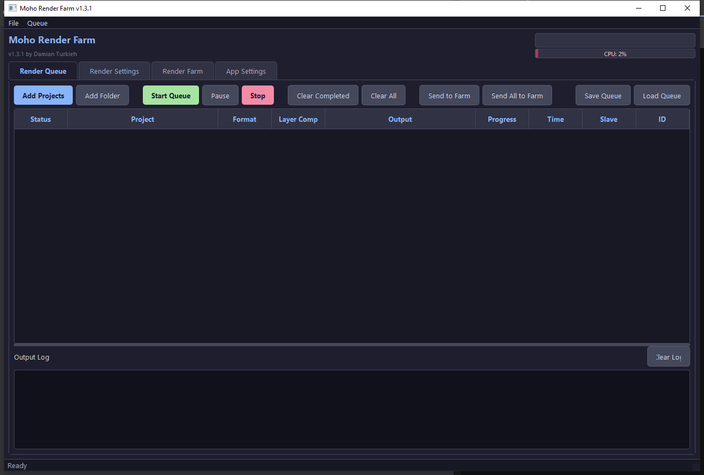
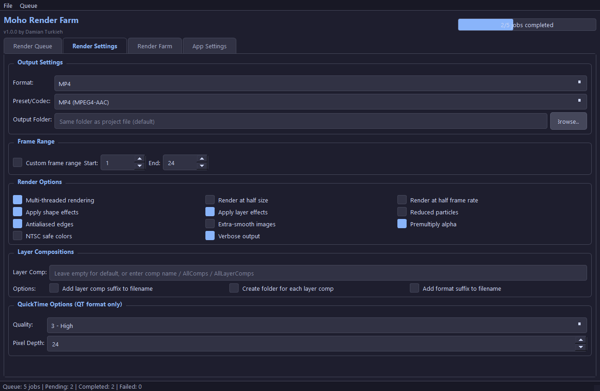
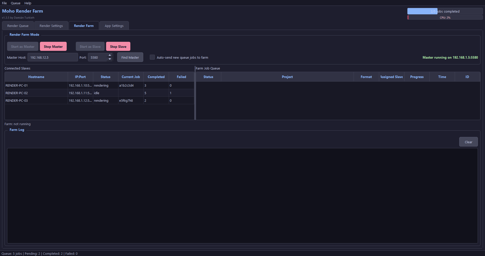
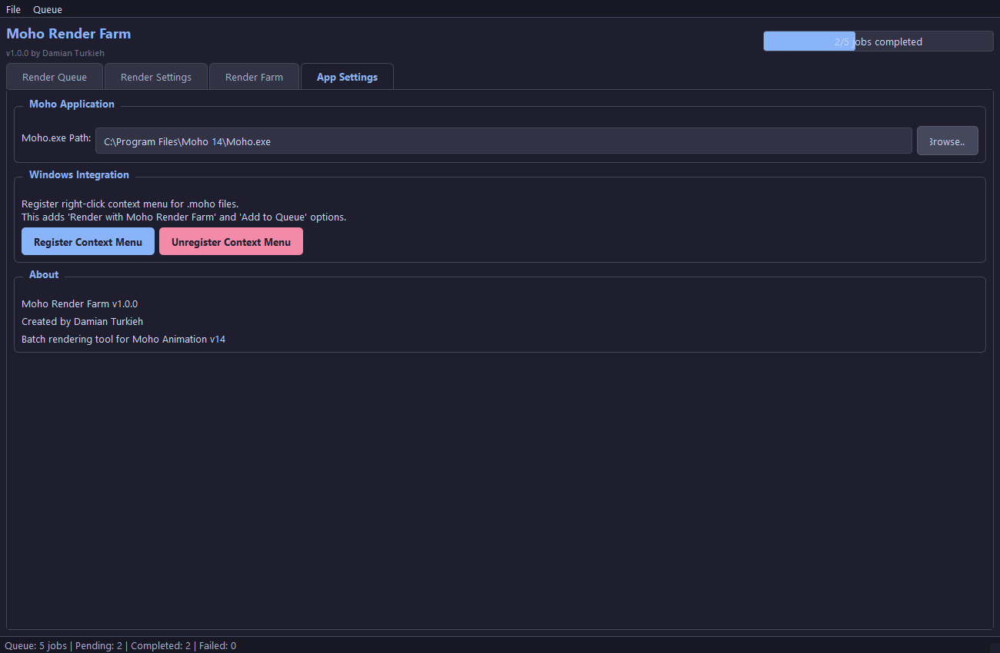

# Moho Render Farm

A comprehensive render farm and batch rendering application for **Moho Animation v14**.

Created by **Damián Turkieh**

---

## Features

- **Batch Rendering** - Queue multiple Moho projects with concurrent rendering support
- **Render Farm** - Master/Slave network system for distributed rendering across multiple PCs, with project file transfer
- **Concurrent Rendering** - Configurable max simultaneous renders (local queue and slave mode)
- **Full GUI** - Dark-themed PyQt6 interface with drag-and-drop support
- **CLI Automation** - Complete command-line interface for scripting and pipelines
- **All Moho Render Options** - Format, codec, frame range, layer comps, antialiasing, multithreading, and more
- **Queue Management** - Save/load queues, reorder, retry, duplicate jobs
- **Render Settings Presets** - Save/load/delete render presets with default preset support
- **Real-time Progress** - Live progress and elapsed time updates during rendering with smart status messages
- **Timestamped Log Output** - All log lines include `[HH:MM:SS]` timestamps
- **Auto-save Log** - Output log is automatically saved to file during queue execution
- **FFmpeg Layer Composition** - Auto-compose layer comp PNG sequences into MP4 after rendering
- **Project Subfolder Output** - Automatically create subfolders named after each project
- **Images Copy** - Copy `\Images` media to project root to fix offline media references
- **Portable Python** - Bundled embeddable Python, no system Python required
- **Auto-save Queue** - Queue is automatically saved on every change and restored on startup
- **Auto-Update** - Automatic update checking and installation from GitHub
- **Windows Integration** - Right-click context menu on .moho files to render or add to queue
- **Drag & Drop** - Drag .moho files directly onto the application window
- **Edit Queue Settings** - Modify render settings for one or multiple queued jobs simultaneously
- **Show in Explorer** - Open project location directly from the queue context menu

---

## Screenshots

### Render Queue


### Render Settings


### Render Farm


### App Settings


---

## Quick Start

### Installation

**No installation needed!** Everything is bundled in the repository: Python, FFmpeg, and all dependencies.

```bash
# Clone or download the repository
git clone https://github.com/turkodamian/MohoRenderFarm.git
cd MohoRenderFarm

# Launch — that's it!
start.bat
```

### Launch

```bash
# GUI mode (double-click or run)
start.bat
```

---

## GUI Usage

The application has 4 main tabs:

### Render Queue Tab
- **Add Projects** - Select one or more .moho files
- **Add Folder** - Scan a folder recursively for Moho projects
- **Start Queue** (F5) - Begin rendering all pending jobs
- **Pause** (F6) - Pause after current job finishes
- **Stop** (F7) - Cancel current render and stop queue
- **Save/Load Queue** - Persist your queue to a JSON file
- **Drag & Drop** - Drag .moho files or folders directly onto the window
- **Right-click** on a job for: Edit Render Settings, Show in Explorer, Retry, Duplicate, Move Up/Down, Remove, Cancel
- **Real-time updates** - Progress percentage and elapsed time update every second during rendering
- **Layer Comp column** - Shows which layer composition is assigned to each job

### Render Settings Tab
Configure all Moho render options that apply to new jobs added to the queue:

#### Render Presets
Save and load your render settings as named presets. Set a default preset that loads automatically on startup.

| Setting | Description | Default |
|---------|-------------|---------|
| Format | Output format (MP4, PNG, JPEG, TGA, BMP, PSD, QT, GIF) | MP4 |
| Preset/Codec | Video codec preset (e.g., "MP4 (MPEG4-AAC)") | MP4 (MPEG4-AAC) |
| Output Folder | Destination folder (empty = same as project) | Project folder |
| Create Subfolder | Create a subfolder named after each project | No |
| Frame Range | Custom start/end frames | Entire animation |
| Multi-threaded | Use up to 5 render threads | Yes |
| Half Size | Render at 50% resolution | No |
| Half FPS | Render at 50% frame rate | No |
| Shape Effects | Apply shape effects | Yes |
| Layer Effects | Apply layer effects | Yes |
| Reduced Particles | Use fewer particles | No |
| Antialiased Edges | Smooth edges | Yes |
| Extra-smooth | Extra image quality | No |
| Premultiply Alpha | Premultiply alpha channel | Yes |
| NTSC Safe Colors | Clamp to NTSC-safe range | No |
| Reverse Layer Order | Reverse compositing order (first alphabetically = background) | Yes |
| Copy Images | Copy `\Images` folder to project root (fix offline media) | No |
| Render AllComps | Checkbox to render all layer comps at once | No |
| Custom Layer Comp | Specific layer comp name or AllLayerComps | None |
| Add Layer Comp Suffix | Append comp name to filename | No |
| Create Folder for Layer Comp | Subfolder per comp | No |
| Add Format Suffix | Append format name to filename | No |
| Auto-compose Layers | Compose all layer comps into MP4 with ffmpeg | No |
| Quality (QT only) | 0=Min, 1=Low, 2=Normal, 3=High, 4=Max, 5=Lossless | 3 (High) |
| Pixel Depth (QT only) | 24 or 32 (for alpha channel) | 24 |

### Render Farm Tab
Set up distributed rendering across multiple PCs:

1. **Master PC**: Click "Start Master" - it will listen for slave connections
2. **Slave PCs**: Click **Find Master** to auto-detect, or manually enter the master's IP and port, then click "Start Slave"
3. Add jobs to the local queue, then use **Send to Farm** / **Send All to Farm** to push them to the farm queue
4. **Any machine can submit jobs** - Use "Add Jobs to Farm" or "Add Folder to Farm" directly from the Farm tab, works from both master and slave machines
5. Slaves automatically pull and render jobs from the farm queue
5. **Auto-send** checkbox: new queue jobs go directly to the farm when master is running
6. **Manual assignment**: Right-click a slave to assign a specific job, or right-click a farm job to assign it to a specific slave
7. **Farm Job Queue table**: Shows all farm jobs with color-coded status (pending/reserved/rendering/completed/failed)
8. **Connected Slaves table**: Color-coded status (green=idle, blue=rendering, red=offline)
9. **Farm Log**: Timestamped log of all farm operations with `[MASTER]`/`[SLAVE]`/`[GUI]` prefixes

### App Settings Tab
- **Moho.exe Path** - Configure the path to Moho.exe (default: `C:\Program Files\Moho 14\Moho.exe`)
- **Max Simultaneous Renders** - Number of concurrent renders (1-16), applies to both local queue and slave mode
- **Default Output Folder** - Set a custom default output folder or use project folder as default
- **Windows Integration** - Register/unregister right-click context menu for .moho files
- **Shortcuts & Startup** - Add desktop shortcut, Start Menu entry, taskbar pin, and auto-start on Windows boot
- **Updates** - Toggle automatic update checks, manually check for updates
- **About** - App version, author, and contact info

### Help Menu
- **Documentation** - Opens the GitHub README in your browser
- **Report a Bug** - Opens a bug report form to send directly to the developer
- **Check for Updates** - Manually check for and install the latest version
- **About** - Application info dialog

---

## FFmpeg Layer Composition

When rendering with layer comps (e.g., `AllLayerComps`) and the **Auto-compose** option enabled, the app will automatically composite all rendered layers into a single MP4 after rendering completes.

### How it works

1. Each layer comp is rendered as a separate PNG sequence in its own subfolder
2. After rendering, ffmpeg overlays all layers using alpha compositing:
   - **Last alphabetically** = background (bottom layer)
   - **First alphabetically** = foreground (top layer)
3. The composed result is saved as `{folder_name}_composed.mp4`

### Requirements

FFmpeg is bundled in the `ffmpeg/` folder. No manual installation needed.

---

## CLI Usage

### Render Files Directly

```bash
# Render a single file as MP4
python main.py --render "MyScene.moho" --format MP4 --options "MP4 (MPEG4-AAC)"

# Render with custom output folder
python main.py --render "MyScene.moho" -f MP4 -o "C:\output\" --verbose

# Render specific frame range
python main.py --render "MyScene.moho" -f PNG --start 1 --end 100

# Render multiple files
python main.py --render "Scene1.moho" "Scene2.moho" "Scene3.moho" -f MP4

# Render a single frame as PNG
python main.py --render "MyScene.moho" -f PNG --start 50 --end 50

# Render at half size for quick preview
python main.py --render "MyScene.moho" -f MP4 --halfsize yes

# Render all layer comps with separate folders
python main.py --render "MyScene.moho" --layercomp AllComps --createfolderforlayercomps yes

# Render with all options
python main.py --render "MyScene.moho" \
    -f MP4 --options "MP4 (H.265-AAC)" \
    -o "C:\renders\output.mp4" \
    --start 1 --end 200 \
    --multithread yes --halfsize no \
    --shapefx yes --layerfx yes \
    --aa yes --extrasmooth no \
    --premultiply yes --verbose
```

### Queue Management

```bash
# Process a saved queue file
python main.py --queue-file "my_queue.json"

# Open GUI with files pre-loaded in queue
python main.py --add-to-queue "Scene1.moho" "Scene2.moho"
```

### Render Farm (Slave Mode)

```bash
# Start as headless slave connecting to master
python main.py --slave --master-host 192.168.1.100 --port 5580
```

### Windows Context Menu

```bash
# Register right-click menu for .moho files
python main.py --register-context-menu

# Remove right-click menu
python main.py --unregister-context-menu
```

### All CLI Options

```
--render, -r FILE [FILE ...]    Render Moho project files
--format, -f FORMAT             Output format (JPEG, PNG, MP4, etc.)
--options PRESET                Codec preset (e.g. "MP4 (MPEG4-AAC)")
--output, -o PATH               Output file or folder
--start FRAME                   Start frame number
--end FRAME                     End frame number
--moho-path PATH                Path to Moho.exe
--verbose, -v                   Verbose output
--quiet, -q                     Quiet mode
--log FILE                      Log file path
--multithread yes|no            Multi-threaded rendering
--halfsize yes|no               Half size rendering
--halffps yes|no                Half frame rate
--shapefx yes|no                Shape effects
--layerfx yes|no                Layer effects
--fewparticles yes|no           Reduced particles
--aa yes|no                     Antialiased edges
--extrasmooth yes|no            Extra-smooth images
--premultiply yes|no            Premultiply alpha
--ntscsafe yes|no               NTSC safe colors
--layercomp NAME                Layer comp (or AllComps/AllLayerComps)
--addlayercompsuffix yes|no     Add layer comp suffix to filename
--createfolderforlayercomps yes|no  Create folder per layer comp
--addformatsuffix yes|no        Add format suffix to filename
--quality 0-5                   Quality (QT only)
--depth NUMBER                  Pixel depth (QT only)
--queue-file FILE               Process a saved queue file
--slave                         Start in headless slave mode
--master-host HOST              Master host for slave mode
--port PORT                     Network port (default: 5580)
--register-context-menu         Register Windows right-click menu
--unregister-context-menu       Remove Windows right-click menu
--gui                           Force GUI mode
```

---

## Supported Formats

### Image Formats (sequence output)
| Format | Extension | Notes |
|--------|-----------|-------|
| JPEG | .jpg | Default format |
| PNG | .png | With transparency |
| TGA | .tga | Targa format |
| BMP | .bmp | Bitmap |
| PSD | .psd | Photoshop layers |

### Video Formats (single file output)
| Format | Preset | Notes |
|--------|--------|-------|
| MP4 | MP4 (MPEG4-AAC) | Most compatible |
| MP4 | MP4 (H.265-AAC) | Better compression |
| M4V | M4V (MPEG4-AAC) | Apple compatible |
| MOV | MOV (ProRes alpha-ALAC) | Professional, with alpha |
| MOV | MOV (PNG alpha-PCM) | Lossless with alpha |
| MOV | MOV (MJPEG-AAC) | Motion JPEG |
| MOV | MOV (MPEG4-AAC) | QuickTime MPEG4 |
| AVI | AVI (PNG alpha-PCM) | Lossless with alpha |
| AVI | AVI (MJPEG-PCM) | Motion JPEG |
| AVI | AVI (Raw-PCM) | Uncompressed |
| ASF | ASF (WMV-WMA) | Windows Media |
| GIF | Animated GIF | Animated GIF |

---

## Network Render Farm

### Architecture

```
Master PC (port 5580)
  |
  +-- Slave PC 1 (requests jobs via HTTP)
  +-- Slave PC 2
  +-- Slave PC N
```

### Setup

1. **All PCs** must have Moho 14 installed and this application set up
2. **All PCs** must be able to access the project files (shared network drive recommended)
3. **Master**: Start the app and click "Start as Master" in the Render Farm tab
4. **Slaves**: Start the app (or use `--slave` CLI flag) and connect to the master IP

### API Endpoints (for custom integrations)

| Endpoint | Method | Description |
|----------|--------|-------------|
| `/api/register` | POST | Register a slave node |
| `/api/heartbeat` | POST | Slave heartbeat |
| `/api/get_job` | GET | Request next available job |
| `/api/job_complete` | POST | Report job completion |
| `/api/status` | GET | Get farm status |
| `/api/add_job` | POST | Add a job to the queue |
| `/api/queue` | GET | Get current queue |

---

## Project Structure

```
MohoRenderFarm/
├── main.py                 # Entry point (GUI + CLI)
├── start.bat               # Quick launcher (double-click to run)
├── python/                 # Bundled portable Python 3.10
├── ffmpeg/                 # Bundled FFmpeg binaries
│   ├── ffmpeg.exe          # FFmpeg encoder
│   └── ffprobe.exe         # FFmpeg probe
├── lib/                    # Bundled Python dependencies (PyQt6, Flask, etc.)
├── scripts/
│   ├── setup_python.py     # Portable Python downloader (for maintenance)
│   └── setup_ffmpeg.py     # FFmpeg downloader (for maintenance)
├── src/
│   ├── config.py           # App configuration
│   ├── updater.py          # Auto-update from GitHub
│   ├── moho_renderer.py    # Moho CLI wrapper engine
│   ├── render_queue.py     # Queue management
│   ├── ffmpeg_compose.py   # FFmpeg layer comp compositor
│   ├── gui/
│   │   ├── main_window.py  # Main GUI window
│   │   ├── styles.py       # Dark theme styles
│   │   └── check.svg       # Checkbox indicator icon
│   ├── network/
│   │   ├── master.py       # Render farm master server
│   │   └── slave.py        # Render farm slave client
│   └── utils/
│       └── context_menu.py # Windows registry integration
├── screenshots/            # GUI screenshots
└── MohoProjects/           # Test projects (gitignored)
```

---

## Requirements

- **Moho Pro 14** (or compatible version)
- **Windows** (tested on Windows 10/11)
- Everything else is bundled: Python 3.10, FFmpeg, PyQt6, Flask, requests — zero installation needed

---

## Configuration

Configuration is stored in `%APPDATA%\MohoRenderFarm\config.json` and includes:
- Moho executable path
- Default output directory
- Default format and preset
- Default render preset name
- Network port settings
- Recent projects and queues

Saved queues are stored in `%APPDATA%\MohoRenderFarm\queues\`.
Render presets are stored in `%APPDATA%\MohoRenderFarm\presets\`.
Render logs are auto-saved to `%APPDATA%\MohoRenderFarm\logs\`.

---

## Changelog

### v1.4.8
- **Stop Rendering Farm Jobs** - Right-click context menu on actively rendering farm jobs now includes "Stop Rendering" to cancel them remotely via the master-slave heartbeat channel
- **Extra-smooth Images Default** - The "Extra-smooth images" checkbox is now enabled by default

### v1.4.7
- **Send Project Files to Farm** - New option to upload the .moho project file (and optionally all sibling files from the same folder) to the master when submitting farm jobs, so slave machines can render without needing local access to the project
- **Include Sibling Files** - Checkbox to also send images, audio, and other files from the project folder (root level only, no subfolders)
- **Copy Images Integration** - When "Copy \Images to project root" is enabled, it runs before bundling so all media files are included in the upload
- **Automatic Cleanup** - Uploaded files are automatically cleaned up on the master and slave after rendering completes

### v1.4.6
- **Startup Update Log** - The console now logs "Checking for updates..." when the app starts and auto-check is enabled

### v1.4.5
- **Fixed Update Check** - "Check for Updates" no longer gets stuck on "Checking..." — all outcomes (update found, up to date, error) are now logged in the console
- **Robust Update Threads** - Background update threads are wrapped in try/except to ensure the UI always recovers even if an unexpected error occurs

### v1.4.4
- **Desktop Shortcut** - Add or remove a desktop shortcut from App Settings
- **Start Menu Shortcut** - Add or remove the app from the Windows Start Menu
- **Taskbar Pin** - Pin or unpin the app to the Windows taskbar
- **Run on Startup** - Enable or disable automatic launch when Windows starts
- All shortcut buttons are toggle-style: they detect current state and show Add/Remove accordingly

### v1.4.3
- **Auto-save & Restore Queue** - The render queue is automatically saved on every change (add, remove, edit, reorder). On startup, the previous session's queue is restored automatically, protecting against crashes or accidental closures

### v1.4.2
- **Detailed Console Logging** - All user actions now logged: queue operations (add, remove, retry, duplicate, cancel, clear), farm events (master/slave start/stop, slave connect/disconnect), file operations (drag & drop, folder import, IPC), render lifecycle (started, completed with time, failed with error), preset loading, settings changes, and update checks
- **Fixed Update Script Launch** - Fixed "failed to launch update script" error caused by a stale file existence check during restart-to-update flow

### v1.4.1
- **Resizable Slave Hostname Column** - The Hostname column in the Connected Slaves table can now be freely resized by the user, like all other columns

### v1.4.0
- **Slave Job Submission** - Slaves can now submit render jobs to the master, not just receive them
- **Farm Tab Buttons** - "Add Jobs to Farm" and "Add Folder to Farm" buttons for submitting jobs directly from any machine
- **Send to Farm from Slave** - "Send to Farm" and "Send All to Farm" buttons now work when connected as slave
- **Fixed Auto-Update** - Staged update via batch script avoids "Access Denied" errors from locked DLLs; PID-based process wait with hidden window prevents hangs
- **Update Confirmation** - Auto-update now asks the user before downloading instead of downloading silently

### v1.3.5
- **Bug Report via Discord** - In-app bug report dialog sends directly to Discord with name, email, log, and screenshot attachment
- **Donate Button** - PayPal donation link in Help menu and App Settings
- **GPL v3 License** - Open-source license with full third-party attribution
- **Scrollable App Settings** - Settings tab is now scrollable so all options are accessible
- **Fixed Button Text Cropping** - Buttons auto-size to fit their text regardless of DPI/font
- **Log Timestamps** - Log entries now include full date and time (`[YYYY-MM-DD HH:MM:SS]`)
- **Updated Screenshots** - Refreshed all GUI screenshots at maximized window size

### v1.3.7
- **Default Options** - "Create subfolder with project name" and "Copy \Images to project root" are now enabled by default

### v1.3.6
- **Context Menu Fix** - Right-click menu now works on PCs with Moho installed by registering under existing ProgIDs and SystemFileAssociations
- **Slave Connection Status** - Status label now correctly shows connected/disconnected state
- **About Links** - Clickable email and website links in About section with readable colors on dark theme

### v1.3.4
- **Zero-Install** - Python, FFmpeg, and all dependencies are now bundled in the repository. Just clone/download and run `start.bat` — no installation step required
- **Removed install.bat** - No longer needed since everything is pre-bundled

### v1.3.3
- **Portable Python** - Installer now downloads and bundles Python 3.10 embeddable, no system Python required
- **Auto-Update** - Checks GitHub for new versions on startup, auto-downloads and installs updates; toggle in App Settings
- **Help Menu** - New menu with Documentation, Report a Bug, Check for Updates, and About
- **About Contact** - Added contact email (damian@realidad360.com.ar) to About section in App Settings

### v1.3.2
- **Find Master** - Auto-discover master server on the local network with one click, scans all IPs on the subnet in parallel
- **Updated Screenshots** - Refreshed all GUI screenshots to reflect the latest features

### v1.3.1
- **Default Output Folder** - App Settings option to set a custom default output folder or use the project folder as default for all renders
- **Reverse Layer Order** - FFmpeg auto-compose now defaults to reversed alphabetical order (first alphabetically = background), with a checkbox to toggle
- **Max Simultaneous Renders moved to App Settings** - Setting relocated from Render Settings to App Settings for easier access

### v1.3.0
- **Concurrent Rendering** - Configurable "Max simultaneous renders" (1-16) in Render Settings, allows rendering multiple jobs at the same time for both local queue and slave mode
- **Render Farm Management** - Complete farm GUI: Send to Farm / Send All to Farm buttons, auto-send checkbox, farm job queue table with color-coded status, connected slaves table with color-coded status
- **Manual Job Assignment** - Right-click slaves or farm jobs to manually assign jobs to specific machines
- **Farm Job Queue** - Full farm queue display with pending/reserved/rendering/completed/failed status, context menu for cancel/return to local queue/clear completed
- **Farm Log** - Dedicated timestamped farm log with `[MASTER]`/`[SLAVE]`/`[GUI]` prefixes for all farm operations
- **FFmpeg Public Download** - FFmpeg now downloads from public BtbN builds (no private repo dependency)

### v1.2.2
- **CPU Monitor** - Real-time CPU usage bar in the header, updated every second via Windows API (no extra dependencies)
- **Confirmation Dialogs** - Stop/Escape, Delete key, and Remove now ask for confirmation before acting

### v1.2.1
- **Single-Instance IPC** - Context menu "Add to Queue" now adds to the existing running instance instead of opening a new window
- **Gradual Progress for PNG AllComps** - Progress column now counts frame files across subdirectories for accurate real-time progress
- **Gradual Progress for MP4** - Progress column shows a time-based estimate instead of staying at 0% until render completes
- **Cleaner Log Output** - Filtered out Moho internal debug lines (FreeImage, InitLMSystem) from the output log
- **Delete Key Fix** - Fixed keyboard shortcut for removing selected jobs from the render queue
- **Layer Comp Defaults** - "Add layer comp suffix", "Create folder for each layer comp", and "Auto-compose" are now checked by default

### v1.2.0
- **Checkbox X Indicator** - Active checkboxes now display a visible X mark for better visual feedback
- **Render AllComps Checkbox** - Dedicated checkbox in Layer Compositions to quickly render all layer comps
- **Custom Layer Comp Field** - Renamed and paired with AllComps checkbox for clearer workflow
- **Smart Heartbeat Messages** - Loading phase shows "Loading project...", stale progress shows "Processing additional layer comps..."
- **Layer Comp Transition Detection** - Log monitor resets progress tracking on "Done!" for multi-comp renders
- **Timestamped Log Output** - All log lines include `[HH:MM:SS]` timestamps
- **Auto-save Log** - Output log automatically saved to `%APPDATA%\MohoRenderFarm\logs\` during queue execution
- **FFmpeg Auto-Download** - FFmpeg downloaded from GitHub Releases via Python (no Git LFS needed)

### v1.1.0
- **Render Settings Presets** - Save/load/delete render presets with default preset support
- **Real-time Progress** - Live progress percentage and elapsed time updates in queue table during rendering
- **Layer Comp Column** - New column in Render Queue showing assigned layer composition
- **Project Subfolder** - Checkbox to auto-create output subfolder named after each project
- **FFmpeg Layer Composition** - Auto-compose all layer comp PNG sequences into MP4 after rendering
- **Copy Images** - Auto-copy `\Images` media to project root before rendering (fix offline media)
- **Edit Render Settings** - Modify settings for one or multiple queued jobs via context menu
- **Show in Explorer** - Open project file location from queue context menu
- **Verbose Render Output** - Real-time log output with heartbeat status every 10 seconds

### v1.0.0
- Initial release with full GUI, CLI, render farm, and all Moho render options

---

## Support

If you find this project useful, consider supporting its development:

[Donate via PayPal](https://www.paypal.me/realidad360)

---

## License

Copyright (c) 2025 Damián Turkieh

This project is licensed under the [GNU General Public License v3.0](LICENSE). You are free to use, modify, and distribute this software under the terms of the GPL v3.

---

## Third-Party Licenses

This project includes the following open-source software:

| Library | License | Copyright |
|---------|---------|-----------|
| [PyQt6](https://riverbankcomputing.com/software/pyqt/) | GPL v3 | Copyright (c) 2025 Riverbank Computing Limited |
| [Qt 6](https://www.qt.io/) | LGPL v3 | Copyright (c) The Qt Company Ltd |
| [Flask](https://palletsprojects.com/p/flask/) | BSD 3-Clause | Copyright (c) 2010 Pallets |
| [Werkzeug](https://palletsprojects.com/p/werkzeug/) | BSD 3-Clause | Copyright (c) 2007 Pallets |
| [Jinja2](https://palletsprojects.com/p/jinja/) | BSD 3-Clause | Copyright (c) 2007 Pallets |
| [Click](https://palletsprojects.com/p/click/) | BSD 3-Clause | Copyright (c) 2014 Pallets |
| [MarkupSafe](https://palletsprojects.com/p/markupsafe/) | BSD 3-Clause | Copyright (c) 2010 Pallets |
| [ItsDangerous](https://palletsprojects.com/p/itsdangerous/) | BSD 3-Clause | Copyright (c) 2011 Pallets |
| [Requests](https://requests.readthedocs.io/) | Apache 2.0 | Copyright (c) Kenneth Reitz |
| [urllib3](https://urllib3.readthedocs.io/) | MIT | Copyright (c) 2008-2020 Andrey Petrov |
| [certifi](https://github.com/certifi/python-certifi) | MPL 2.0 | Copyright (c) Kenneth Reitz |
| [charset-normalizer](https://github.com/Ousret/charset_normalizer) | MIT | Copyright (c) 2025 Ahmed Tahri |
| [idna](https://github.com/kjd/idna) | BSD 3-Clause | Copyright (c) 2013-2025 Kim Davies |
| [Blinker](https://blinker.readthedocs.io/) | MIT | Copyright (c) 2010 Jason Kirtland |
| [Colorama](https://github.com/tartley/colorama) | BSD 3-Clause | Copyright (c) 2010 Jonathan Hartley |
| [PyQt6-SIP](https://riverbankcomputing.com/software/sip/) | BSD 2-Clause | Copyright (c) 2025 Phil Thompson |
| [FFmpeg](https://ffmpeg.org/) | GPL v3 | Copyright (c) FFmpeg developers |

Full license texts are included with each library in the `lib/` directory.
